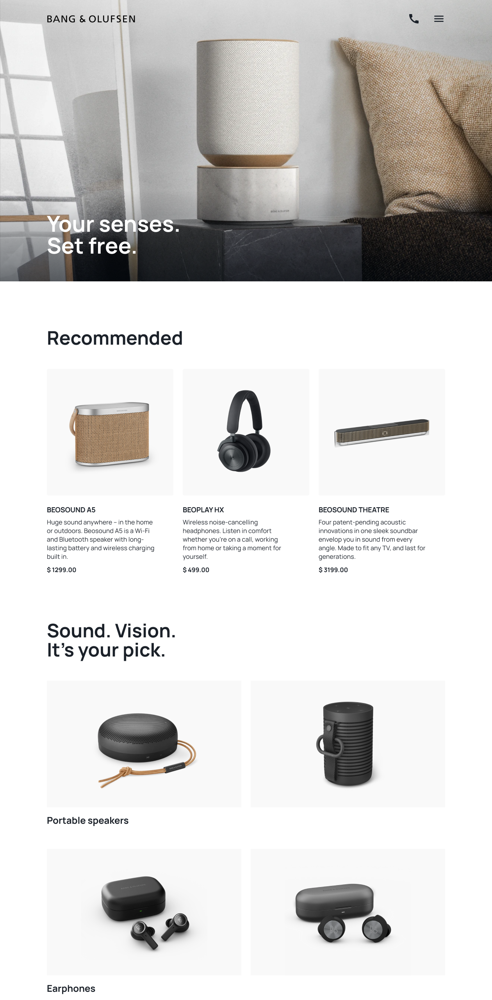
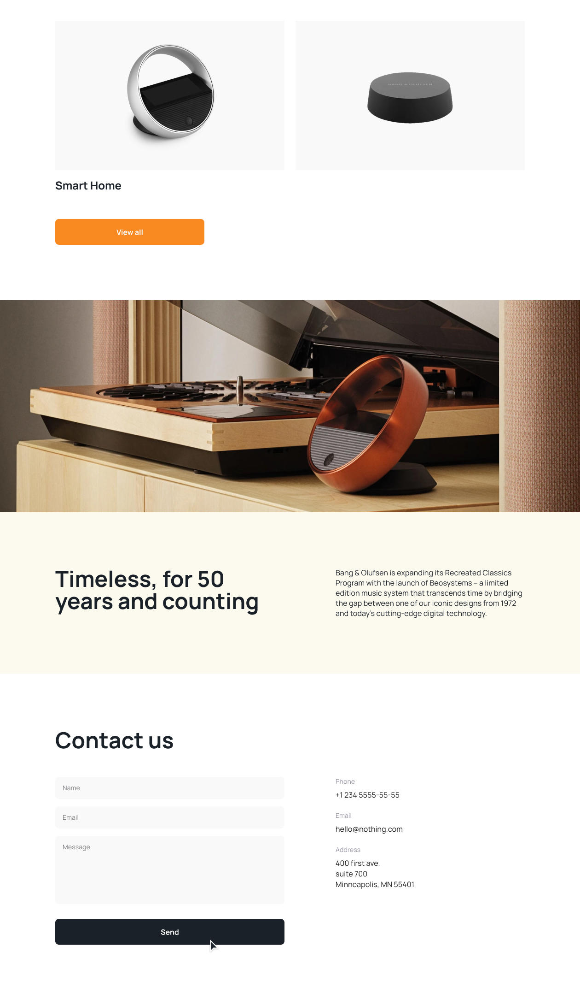

#  Welcome to The Bang & Olufsen Landing Page repository!

- [DEMO LINK](https://chrishryts.github.io/page-landing/)
- [MOCKUP](https://www.figma.com/design/DtkQmQ797hk0nI4KfMi2Uq/BOSE-New-Version?node-id=6817-212/)

  
  

This project involves creating a responsive landing page using HTML, SCSS (Sassy CSS) and the BEM (Block Element Modifier) methodology.

## Features

- The landing page is completely responsive, ensuring it is accessible across mobile devices, tablets and desktops.
- Added a burger menu that appears upon button click. All links in this menu redirect to the desired sections of the page.
- Each button is entirely operational, enabling clicks on phone numbers, email addresses, and the address, which redirects to Google Maps.
- Interactive hover effects are implemented to enrich user engagement.
- Validation attributes are added to form fields to ensure accurate input, including specific types like email.
- Form submission clears fields without reloading the page, ensuring a seamless user journey.
- The footer stays anchored at the bottom of the page.

Your input is welcome! If you discover any bugs or have ideas for improvements, feel free to send email here khrystyna.hryts@outlook.com or submit a pull request.
